# How Beer Changed the World

## Summary

A presentation given at Spring 2025 [[CSU Ram Talks|Ram Talks]] by Charlie Hoxmeier on How Beer Changed the World

## Changelog

- #🗓️/2025/02/26 Ram Talks presentation by Charlie Hoxmeier

## Resources

- [Slide Deck](https://docs.google.com/presentation/d/1CZmmjxF_LBOfZHniv4DGYcOI5dWlAbFmrLfRUnTCeoA/edit?usp=sharing)
- [Audio Recording](https://recorder.google.com/3e110e37-b9b5-43f5-b901-7aa493fa7c1c)

## Action Items

## FAQ

> [!question] Title
> Contents
> [Source]()

- Q: What are the four main ingredients in beer?
	A: Water, hops, malted grains (e.g., barley, wheat, oats, rye), and a microbe (usually yeast; sometimes bacteria for sour beers).

- Q: Why is water quality so important in brewing?
	A: Beer is 90–95% water. Mineral content affects flavor and which styles brew best. Historically, soft water (Pilsen) favored light lagers; hard water (London, Dublin) favored darker beers. Today, brewers “build” water by adjusting minerals to match target styles.

- Q: Why was beer historically safer to drink than water?
	A: The brewing process includes a boil, which sanitizes the liquid. John Snow traced a London cholera outbreak to a contaminated well and noted brewers weren’t getting sick because their beer had been boiled.

- Q: What did people use before hops?
	A: Gruits—herbal blends (heather, meadowsweet, yarrow, mugwort)—to add flavor complexity and bitterness.

- Q: What do hops contribute to beer?
	A: Bitterness (to balance malt sweetness), flavors/aromas (herbal, piney, fruity, floral), and antimicrobial compounds that extend shelf life.

- Q: Why do some beers “skunk,” and do bottle colors matter?
	A: UV light breaks a sulfur-containing hop compound, producing a skunky aroma. Brown glass blocks UV best; green offers limited protection. Clear bottles risk skunking unless the brewer uses UV-stable hop extracts. Sunlight can skunk beer in seconds.

- Q: What is malt and why is malting necessary?
	A: Malted cereal grains provide fermentable sugars. Malting soaks and germinates the grain, then kilns it to develop flavors (Maillard reactions) and make starches accessible for conversion to sugars during mashing.

- Q: Can you make beer without each ingredient?
	A: Yeast (or another fermenting microbe) is the only truly required ingredient. Brewers can substitute other sugar sources for malt, or herbs for hops, and even ferment fruit juices (though that veers into wine/cider/mead).

- Q: What does yeast do in brewing?
	A: Yeast consumes sugars and produces ethanol and CO2 as byproducts, plus flavor compounds (esters like banana; acetaldehyde like green apple). Brewers select yeast strains for specific flavor profiles and alcohol tolerance.

- Q: Where did ancient brewers get yeast?
	A: From the environment—grains, flowers, and surfaces are covered with wild yeasts and bacteria. Reusing the creamy sediment (“slurry”) from a successful batch led to early domestication/selection of brewing yeasts.

- Q: How sour beers are made—are they “good for you”?
	A: Sour beers ferment with bacteria (similar to those in yogurt/cheese). They are probiotic, though “health benefits” shouldn’t be overstated.

- Q: What are the basic steps of brewing?
	A: Mill grain → mash with water to convert starch to sugar → boil (add hops) → chill → ferment in tanks with yeast → condition/pack. Fermentation typically takes 10–30 days; sours can take longer.

- Q: How did brewing drive scientific and technological advances?
	A: Examples:
	- Gas over open fermenters led Priestley/Black to study CO2.
	- Pasteur/Hansen/van Leeuwenhoek linked yeast to fermentation; germ theory and pasteurization followed.
	- Mechanical refrigeration (Carl von Linde) was developed to keep beer cold.
	- Liquefaction of gases aided oxygen purification and the oxyacetylene torch.
	- Student’s t-test (William S. Gosset at Guinness) to analyze batch variation.
	- pH scale (S. P. L. Sørensen at Carlsberg) to standardize acidity measurement.
- Q: What happens to spent grain and yeast from brewing?
	A: Local farmers collect them as high-nutrition animal feed. The brewery in the talk sends out about 2.5 tons weekly; none goes to landfill.

- Q: How strong were ancient beers?
	A: Likely low-alcohol and often sour due to mixed fermentations. Egyptians had multiple strengths and even taxed beer by strength, but exact methods aren’t fully known.

- Q: How do mead and cider fit into the timeline?
	A: Mead likely tracks close to early beer (Scandinavia used honey where barley couldn’t be grown). Cider arrived later with widespread orchard cultivation. Beer/mead predate wine in many regions.

- Q: How is climate change affecting beer?
	A: Drought raises grain protein and lowers starch, reducing brewing efficiency. Supply disruptions (e.g., Ukraine barley) add pressure. Many brewers are investing in local, regenerative agriculture to improve resilience.

- Q: How much water does it take to make beer?
	A: Small breweries average around 17 gallons of water per gallon of beer; with focused conservation, the speaker’s brewery cut from ~12:1 to ~6.5–6.7:1. Large breweries achieve ~2.3–3:1. Including farming, total water can reach ~40+:1. Brewery water use is largely non-consumptive (returns to treatment); irrigation on fields is consumptive.

- Q: Where does the brewery’s water come from?
	A: Primarily the Poudre River or Horsetooth Reservoir, depending on conditions. Brewers coordinate with water treatment operators (e.g., switching sources after wildfires to avoid sediment/organics).

- Q: What is “wort”?
	A: The sweet, unfermented liquid produced from mashing and boiling. Brewers make wort; yeast makes beer.

## Content

## Transcription

I'll start with the ingredients we use in brewing and how they’re folded into the process.

Water
- Beer is 90–95% water, so we need clean water with a known mineral profile. Historically, brewers didn’t know the chemistry of their water, which is why certain beer styles are tied to specific places.
- Pilsen in the Czech Republic has very soft water, ideal for bright, delicate pale lagers. London’s water is hard and carbonate-rich, which suits dark beers like porters. Dublin’s water is even harder, favoring stouts such as Guinness. People learned by trial and error long before they understood the cause was water chemistry.
- In Fort Collins, our water is very soft—quite like Pilsen—so today we can “build” water by adding minerals to mimic any classic profile and brew any style.
- On safety: for centuries beer was often safer than water. In the mid-1800s, physician John Snow (the epidemiologist, not the Night’s Watch one) investigated a deadly cholera outbreak in London. He noticed brewers weren’t getting sick. Their process includes a boil, which sanitizes the liquid. That insight helped him trace the source to a contaminated well.

Hops
- Hops weren’t always part of beer. Before they were widely cultivated, brewers made gruit—beverages flavored with herbs like heather, meadowsweet, yarrow, and mugwort—to add bitterness and complexity and counter malt sweetness.
- Flemish farmers cultivated hops in Europe and brought them to Kent, England (now a renowned hop region). Hops were grown in large fields and dried in oast houses.
- Hops bring herbal, piney, fruity, or floral flavors; they also contribute bitterness by extracting very bitter compounds that balance malt. Critically, hops add antimicrobial compounds that inhibit spoilage, extending shelf life.
- Today, nearly all beers use hops—lightly for balance or heavily for flavor and aroma (think IPAs). True gruits are rare.

Malt
- We can brew with many cereals: barley, wheat, oats, rye, and gluten-free grains like sorghum, millet, or quinoa. But we malt them first to make brewing efficient.
- Think of malting like toasting bread: low “toasting” yields pale, light flavors; more heat yields caramel notes; very high heat yields roasted flavors. That’s not just an analogy—the Maillard reaction between sugars and proteins creates melanoidins, just like on toast.
- Our local partner, Root Shoot Malting, grows barley (and other grains) and malts it for regional brewers.

Microbes
- The only truly indispensable ingredient is a fermenting microorganism—usually yeast, sometimes bacteria. You can swap malt for other sugar sources, omit hops (use herbs), even use fruit juice instead of water, but you still need a fermenter.
- Saccharomyces yeasts are everywhere—on plants, in the environment, on us—and historically piggybacked into beers with flowers and grain. Yeast was the first organism fully sequenced, so we know a lot about it.
- Yeast converts wort sugars into carbon dioxide and ethanol—the waste products of yeast metabolism that happen to be what we want. Alcohol production gives yeast an evolutionary edge by suppressing competing microbes (as we all relearned with hand sanitizer).
- Brewers have domesticated and selected yeast strains for alcohol tolerance and flavor pathways: esters (banana-like fruitiness), green-apple acetaldehyde, higher alcohols, and so on. There are now hundreds of strains with distinct profiles.
- Sour beers rely on bacteria (the same probiotic genera used for yogurt and cheese).

How we brew
- We start with malted grain. Malting has three main steps: steeping, germination, and kilning. We “trick” the seed into starting to grow (activating enzymes to access starch), then halt it with heat. Adjusting kilning controls flavor and color.
- Inside each kernel is starch. Starch becomes sugar; sugar becomes alcohol. We mill the grain, mash it with hot water (it looks and smells like oatmeal), and convert starches into fermentable sugars.
- We boil the sweet liquid (wort) to sanitize it—this is the step that made beer safer than water—and add hops at different times for bitterness, flavor, and aroma.
- Then we cool the wort and transfer it to a fermenter, pitch yeast, and let the yeast make beer. Brewers make wort; yeast makes beer. Fermentation typically takes 10–30 days (sours can take much longer). After conditioning and any finishing steps, it’s ready.

Brewing-driven innovations
- Working in Scottish and English breweries, Joseph Black and Joseph Priestley observed a “different air” flowing from open fermenters that extinguished candles—later identified as CO2. This was pivotal to recognizing distinct gases and fed into the chemical revolution.
- Louis Pasteur, Emil Christian Hansen, and Antoni van Leeuwenhoek (among others) established yeast as a living, single-celled organism, leading to pasteurization, germ theory, and sterile technique—huge advances that began with studying brewery “sludge.”
- In 1875, Bavarian brewers, with engineer Carl von Linde, developed mechanical refrigeration primarily to keep beer cold. Their work on gas liquefaction helped isolate pure oxygen, enabling the oxy-acetylene torch that built modern infrastructure.
- In 1908, William Sealy Gosset at Guinness (publishing as “Student”) created the Student’s t-test to analyze batch variability—now foundational in statistics.
- In 1909 at the Carlsberg lab, a scientist formalized the pH scale to standardize acidity measurements while studying beer’s acidity (one reason beer is microbiologically stable).

Our applied science
- We sit at the junction of academia and practice—turning student research into brewer-friendly tools (e.g., assays for off-flavors), profiling novel flavor compounds with advanced analytical chemistry, and piloting water-conservation methods to make brewing more sustainable.

Q&A highlights

Bottle color and skunking
- Sunlight’s UV knocks a sulfur fragment off hop-derived compounds, forming a skunk-like aroma within seconds. Brown glass blocks UV best; green glass helps a little. Clear-glass beers use UV-stable hop products to avoid skunking, but any freshly hopped beer in direct sun can “light-strike” almost instantly.

Spent grain
- Local farmers eagerly take our spent grain (often blended with surplus yeast) as nutritious animal feed. We send out around 2.5 tons weekly. In this area, none of it goes to landfill.

Beer vs. cider vs. mead timeline
- Cider likely came later with large-scale orcharding. Mead—honey, water, and yeast—was common in places unsuitable for barley (e.g., Scandinavia) and probably overlapped closely with early beer. Both predate wine in many regions.

Where ancient yeasts came from
- Yeast and bacteria are ubiquitous on grain, plants, and people, so early mashes naturally fermented—often as mixed, sour fermentations. Brewers noticed a creamy sediment after fermentation; reusing it (“God-is-good”) kickstarted the next batch. Repeating this favored desirable yeasts—an early form of domestication and selection.

Early alcohol strength and Egyptian practice
- Early beers were probably low in alcohol due to competition between yeasts and bacteria. Egyptians produced multiple strengths (taxed differently). We don’t know their exact method; today we’d increase strength simply by using more grain.

Climate change and supply
- In 2012, drought in the U.S. barley belt (ND/SD/MN) raised grain protein and reduced starch, lowering brewhouse efficiency. War in Ukraine also disrupted barley supply. These shocks highlight the value of local maltsters (like Root Shoot) and the need to prepare for potential food-system strains that could impact beer.

Water use and sources
- Our water usually comes from the Poudre River or Horsetooth Reservoir, depending on conditions. After fires, operators may switch sources preemptively; Horsetooth runs slightly different in pH, which we account for.
- Small breweries are typically water-inefficient: averages near 17 gallons of water per gallon of beer. Large plants (24/7 operations) recapture heat and water, achieving ~2.3–3:1.
- By tracking and tightening our practices, we cut our brewery water use roughly in half—from ~12:1 to about 6.5–6.7:1.
- If you include on-farm irrigation, the total water footprint can exceed 40:1. Brewery water is mostly non-consumptive (goes down the drain, is treated, and returns to the system). Field irrigation is consumptive and slow to return to the aquifer.
- We work with growers on regenerative practices to reduce agriculture’s footprint and keep supply chains resilient and local.

## Mermaid Diagram

---

```mermaid
mindmap
  root((Brewing))
    Ingredients
      Water
        Water makes up about 90-95 percent of beer
        Mineral profile shapes beer style
        Historical styles by local water
          Pilsen soft water gives light bright lagers
          London hard carbonate water gives porters
          Dublin harder water gives Irish stouts
        Modern water control
          Fort Collins soft water is similar to Pilsen
          Brewers can build minerals for any style
        Safety and history
          Boil step sanitizes wort so beer was safer than water
          John Snow traced cholera to a well while brewers near beer stayed healthy
      Hops
        Functions
          Bitterness
          Aroma herbal piney fruity floral
          Antimicrobial effect
        History
          Pre hop gruits such as heather yarrow mugwort
          Flemish farmers brought hops to Kent and dried them in oast houses
          Neo mexicanus hops native to southern Colorado with earthy character
        Usage today
          Small additions for bitterness
          Large late additions for flavor and aroma
          IPAs are hop forward styles
          Nearly all modern beers use hops
      Malts and cereal grains
        Grains
          Barley wheat oats rye
          Gluten free options sorghum millet quinoa
        Malting steps
          Steep grain in water
          Germinate to form roots and shoots
          Kiln to control flavor and color
          Maillard reactions create melanoidins like toast from light to dark
        Local supply
          Root Shoot Malting as a local family farm and malthouse
      Microbes
        Yeast is the only required ingredient
          Brewing yeast is Saccharomyces
          Yeast is ubiquitous and originally came in on flowers and grain
          Ferments sugars into carbon dioxide and ethanol
          Ethanol suppresses many competing microbes
          Brewers selected strains for alcohol tolerance and flavor
          Yeast metabolites include fruity esters like banana and green apple notes
        Bacteria for sour beers
          Often the same probiotic species used in yogurt and cheese
          Sour beer can be healthful when consumed moderately
    Brewing process
      Malted grain is milled
      Mash converts starch to sugars like oatmeal
      Kettle boil near 200 F at altitude
        Boil sanitizes the wort
        Hops are added at specific times
      Cool and transfer to fermenter
        Brewers make wort and yeast make beer
        Fermentation typically ten to thirty days or longer
        Mixed fermentation sours can age much longer
      Post processing and packaging
        Beer is carbonated conditioned and made ready to drink
    Innovations driven by brewing
      Gases and carbon dioxide
        Joseph Priestley and Joseph Black observed fixed air from open fermenters
        This work helped early chemists understand gases and elements
      Yeast as an organism
        Antonie van Leeuwenhoek first saw yeast cells under microscopes
        Louis Pasteur and Emil Christian Hansen showed yeast is a living fermenter
        Brewing research led to pasteurization germ theory and sterile technique
      Refrigeration around 1875
        Carl von Linde worked with Bavarian brewers to keep lager beer cold
        His machines enabled gas liquefaction and purified oxygen
        That work supported oxy acetylene torches and many industrial processes
      Statistics
        In 1908 William Sealy Gosset at Guinness created Students t test
      pH scale
        In 1909 the Carlsberg laboratory defined acidity as the power of hydrogen
    Sustainability and water
      Water sources
        Poudre River and Horsetooth Reservoir as main sources
        Brewery may switch sources based on conditions such as post fire sediment
        Brewers coordinate closely with water treatment operators
      Water use intensity
        Small breweries average about seventeen to one water to beer
        Large brewers such as AB near two point three to one
        New Belgium and Sierra Nevada around three to one
        This brewery improved from roughly twelve to one to about six point six to one
        Including farming the figure can reach about forty to one mostly outside brewery control
        Distinguish non consumptive brewery use from consumptive irrigation use
      Raw materials and climate
        The two thousand twelve drought raised barley protein and lowered starch
        Higher protein and lower starch reduced brewhouse efficiency
        Barley disruption in Ukraine affects global supply
        Supporting local regenerative agriculture such as Root Shoot Malting reduces footprint
      Byproducts
        Spent grain and surplus yeast are delivered as animal feed
        Roughly two and a half tons each week can avoid landfill
    QA highlights
      Bottle color and skunking
        Ultraviolet light cleaves hop sulfur compounds and causes skunky aroma
        Brown glass gives the best protection
        Green glass gives partial protection
        Clear bottles often use hop extracts that are stable under ultraviolet light
        Sunlight can skunk beer within seconds on a patio table
      Cider versus mead versus beer timeline
        Mead appears roughly with early beer especially in northern Europe
        Cider becomes common later with apple cultivation
        Wine develops as grape growing spreads
      Ancient yeast sources
        Yeast came from grain air and human contact
        Early beers were low in alcohol and often sour
        Brewers reused sediment from previous batches leading to domestication by selection
      Alcohol strengths in antiquity
        Egyptians brewed multiple beer strengths and taxed them by strength
        Exact brewing methods remain uncertain
      Spent grain users
        Local hog cattle and chicken farmers compete for spent grain as nutritious feed
```

