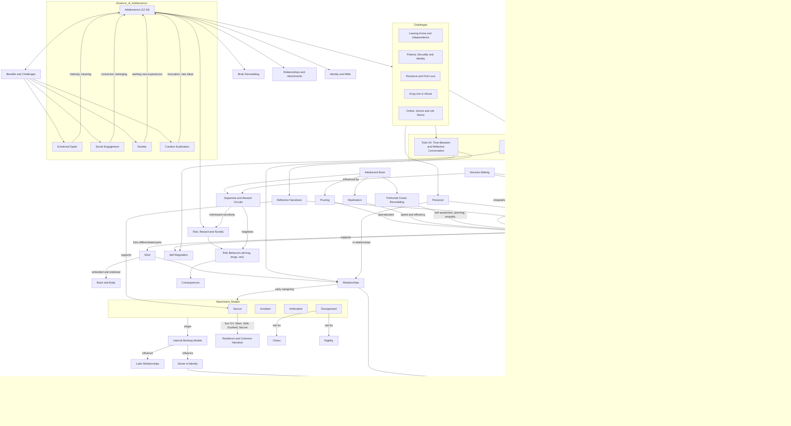

```mermaid
graph TD

%% CORE FOCUS
A["Adolescence (12-24)"] --> A1["Benefits and Challenges"]
A --> A2["Brain Remodeling"]
A --> A3["Relationships and Attachments"]
A --> A4["Identity and MWe"]
A --> A5["Risk, Reward and Novelty"]

%% ESSENCE OF ADOLESCENCE
subgraph Essence_of_Adolescence
  ES["Emotional Spark"] -->|"intensity, meaning"| A
  SE["Social Engagement"] -->|"connection, belonging"| A
  N["Novelty"] -->|"seeking new experiences"| A
  CE["Creative Exploration"] -->|"innovation, new ideas"| A
end

A1 --> ES
A1 --> SE
A1 --> N
A1 --> CE

%% BRAIN & MIND
B["Adolescent Brain"] --> B1["Pruning"]
B --> B2["Myelination"]
B --> B3["Prefrontal Cortex Remodeling"]
B --> B4["Dopamine and Reward Circuits"]

B1 -->|"specialization"| INT["Integration"]
B2 -->|"speed and efficiency"| INT
B3 -->|"self-awareness, planning, empathy"| INT
B4 -->|"risk/reward sensitivity"| A5

INT -->|"links differentiated parts"| M["Mind"]
INT -->|"supports"| SR["Self-Regulation"]
INT -->|"supports"| SA["Self-Awareness"]
INT -->|"supports"| EMP["Empathy"]
INT -->|"supports"| MOR["Morality"]

M -->|"embodied and relational"| BR["Brain and Body"]
M --> REL["Relationships"]

%% MINDSIGHT
MS["Mindsight"] --> SA
MS --> EMP
MS --> INT

subgraph Mindsight_Maps
  MS1["Map of Me (Insight)"] --> SA
  MS2["Map of You (Empathy)"] --> EMP
  MS3["Map of We (Morality)"] --> MOR
end

MS --> MS1
MS --> MS2
MS --> MS3

%% WHEEL OF AWARENESS
WA["Wheel of Awareness"] --> MS
WA -->|"integrating consciousness"| INT

%% ATTACHMENT & RELATIONSHIPS (PART III)
subgraph Attachment_Models
  SEC["Secure"]
  AVO["Avoidant"]
  AMB["Ambivalent"]
  DIS["Disorganized"]
end

REL -->|"early caregiving"| Attachment_Models
Attachment_Models -->|"shape"| IW["Internal Working Models"]
IW -->|"influence"| RER["Later Relationships"]
IW -->|"influence"| IDS["Sense of Identity"]

SEC -->|"four S's: Seen, Safe, Soothed, Secure"| POS["Resilience and Coherent Narrative"]
DIS -->|"risk for"| CHAOS["Chaos"]
DIS -->|"risk for"| RIG["Rigidity"]

RN["Reflective Narratives"] -->|"making sense of life"| INT
RN -->|"supports"| SEC

%% MINDSIGHT TOOLS (PRACTICES)
subgraph Mindsight_Tools
  MT1["Tools #1: Seeing and Shaping the Sea Inside"]
  MT2["Tools #2: Time-In and Wheel of Awareness"]
  MT3["Tools #3: Time-Between and Reflective Conversation"]
  MT4["Tools #4: Mindsight Simple Seven"]
end

MT1 --> MS
MT1 --> SA
MT2 --> WA
MT2 --> MS
MT3 --> RN
MT3 --> REL
MT4 -->|"sleep, focus, play, connection"| INT
MT4 --> SR

%% RISK, REWARD & DECISIONS (PART II & IV)
A5 --> RR["Risk Behaviors (driving, drugs, sex)"]
RR --> CON["Consequences"]
B4 -->|"heightens"| RR

DEC["Decision Making"] -->|"influenced by"| B4
DEC -->|"improved by"| INT
DEC -->|"supported by"| MS

PRES["Presence"] -->|"staying with experience"| INT
PRES -->|"in relationships"| REL

%% CHANGES & CHALLENGES (PART IV)
subgraph Challenges
  C1["Leaving Home and Independence"]
  C2["Puberty, Sexuality and Identity"]
  C3["Romance and First Love"]
  C4["Drug Use or Abuse"]
  C5["Online, School and Life Stress"]
end

A --> Challenges
Challenges --> PRES
Challenges --> MT3
Challenges --> MT4

%% IDENTITY & "MWe"
IDS --> MW["MWe (Me + We, Integrated Identity)"]
REL --> MW
INT --> MW
MS3 --> MW

MW -->|"links individual and collective"| PLANET["Contribution to World and Planet's Health"]
MW -->|"extends essence of adolescence"| ADULT["Adulthood with Vitality"]
```

