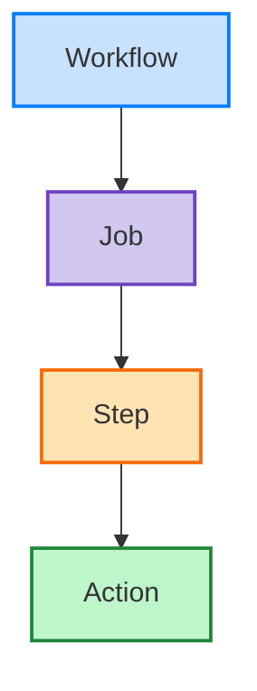

# GitHub Actions

## Summary

## Changelog

## Resources

- [Workflow Syntax Documentation](https://docs.github.com/actions/reference/workflow-syntax-for-github-actions)

## Action Items

## FAQ

> [!question] Title
> Contents
> [Source]()

## Components of GitHub Actions

The components of GitHub Actions are the:

````col
```col-md
![[GitHub Actions Components.png]]
```

```col-md

````

### Workflows

An automated process within a repo. It must have at least 1 job and can be triggered by various events. Workflows can be used to build, test, package, release, or deploy

### Jobs

The first major component within a workflow. Associated with a runner. The runner can be GitHub-hosted or Self-hosted. The `runs-on:` attribute specifies the runner, with `ubuntu-latest` being an example.

### Steps

An individual task that can run commands within a job.

### Actions

Standalone commands within the workflow that are executed. Standalone commands can reference:
- custom actions
- community actions (`actions/checkout@v2` being an example)
- bash commands (`npm install` being an example)

## Configuring When a Workflow Will Run

### Schedule via Cron Syntax

```yaml
# Every 15 minutes
on:
  schedule:
    - cron:  '*/15 * * * *'
```

### Manual Click in the UI

Workflows can be manually triggered using the `workflow_dispatch` event. This event allows for running a workflow by clicking `Run Workflow` button within the GitHub UI

```yaml
on:
  workflow_dispatch:
    inputs:
      logLevel:
        description: 'Log level'     
        required: true
        default: 'warning'
      tags:
        description: 'Test scenario tags'
```

### Manual REST API Call

In addition to `workflow_dispatch`, you can use the GitHub API to trigger a webhook event called `repository_dispatch`.

This event allows you to trigger a workflow for activity that occurs outside of GitHub, essentially serving as an HTTP request to your repository asking GitHub to trigger a workflow off an action or webhook. Using this manual event requires you to do two things:
1. send a `POST` request to the GitHub endpoint `/repos/{owner}/{repo}/dispatches` with the webhook event names in the request body
2. configure your workflow to use the `repository_dispatch` event

```bash
curl \
  -X POST \
  -H "Accept: application/vnd.github.v3+json" \
  https://api.github.com/repos/octocat/hello-world/dispatches \
  -d '{"event_type":"event_type"}'
```

```yaml
on:
  repository_dispatch:
    types: [opened, deleted]
```

### Webhook Events

A workflow can run when specific webhook events occur on GitHub. You can trigger most webhook events from more than one activity for a webhook. If multiple activities exist for a webhook, you can specify an activity type to trigger the workflow. For example, you can run a workflow for the `check_run` event, but only for the `rerequested` or `requested_action` activity types.

```yaml
on:
  check_run:
    types: [rerequested, requested_action]
```

### Conditional Keywords

Use of the `if` conditional and use of `${{ <expression> }}` syntax can be used to conditionally run [[#Jobs]] & [[#Actions]]

```yaml
name: CI
on: push
jobs:
  prod-check:
    if: github.ref == 'refs/heads/main'
    runs-on: ubuntu-latest
    steps:
```

## Use Specific Versions of an Action

```yaml
steps:    
  # Reference a specific commit
  - uses: actions/setup-node@c46424eee26de4078d34105d3de3cc4992202b1e
  # Reference the major version of a release
  - uses: actions/setup-node@v1
  # Reference a minor version of a release
  - uses: actions/setup-node@v1.2
  # Reference a branch
  - uses: actions/setup-node@main
```
