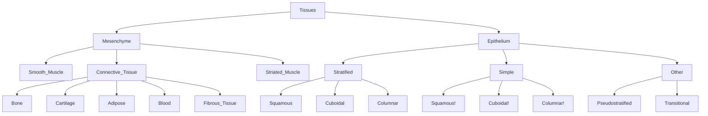
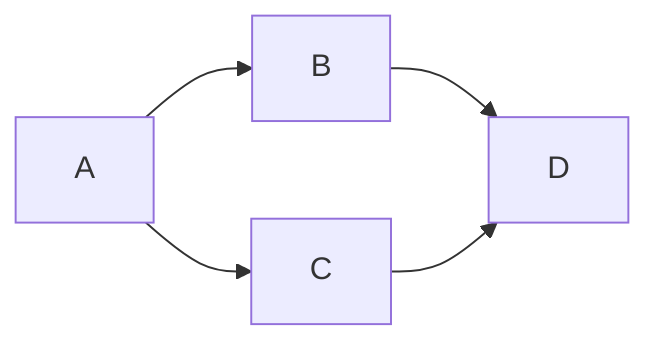
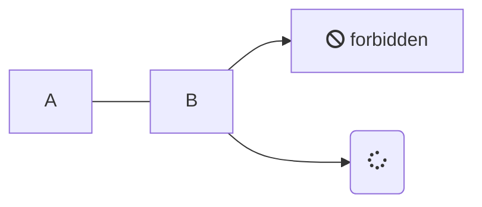
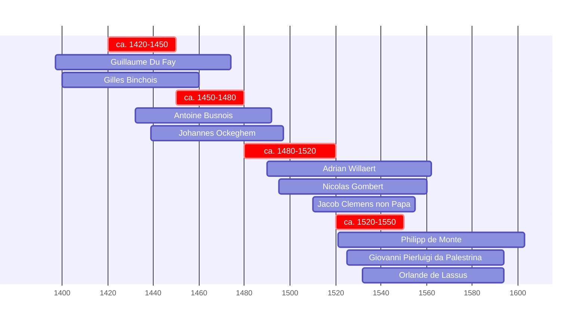
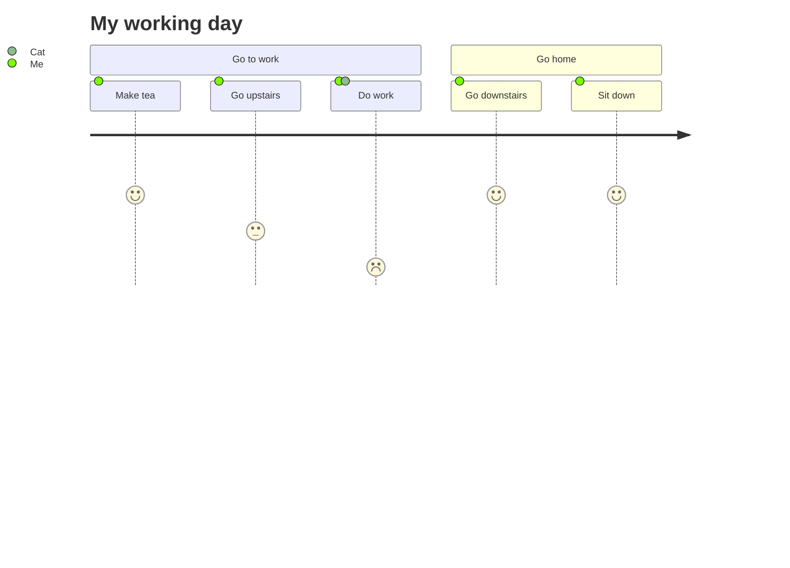
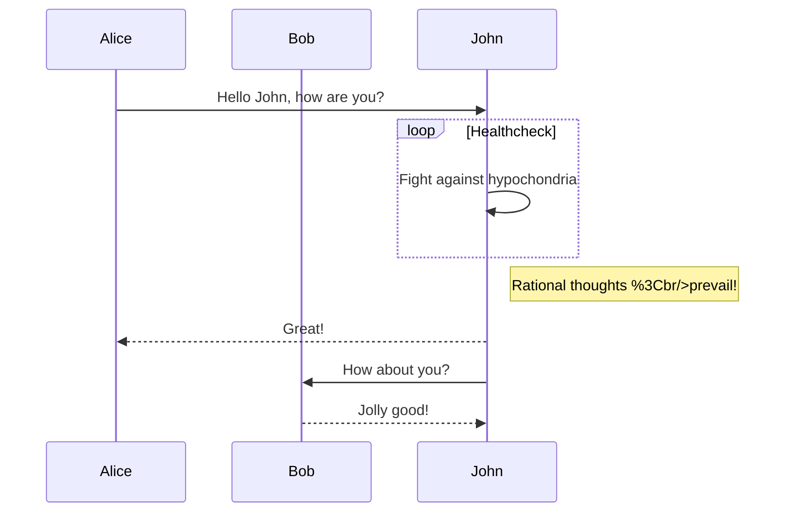
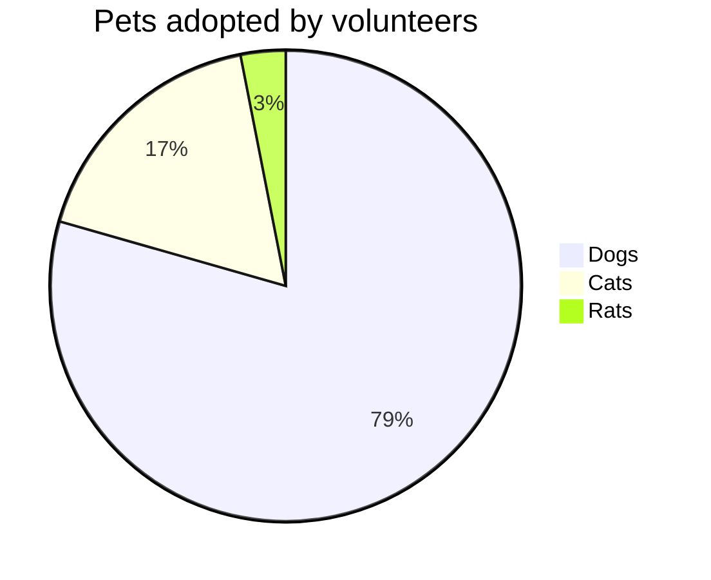

# Obsidian

## Summary

## Changelog

- [x] #🗓️/2020/10/24 Used AWK to merge whole list of files #awk
	- `awk '{print}' \*.extension > ../filename.extension
- [x] #🗓️/2020/10/24 Wrote [function to convert dates into Wiki format dates](https://gist.github.com/functionalStoic/c05d87de6c9723fe402d8666196f89ba)
- [x] [Why Make Digital Notes](https://www.youtube.com/watch?v=-0tYwMeCJj) #source/publications/lyt
- [x] [What Obsidian is Doesn't Matter](https://www.youtube.com/watch?v=N5fCwUW_G-Q&feature=emb_logo) #source/publications/lyt
	- Strive to not be allured in by features, instead, focus on the reason notes benefit my life, i.e. manage my thoughts and collect curated ideas

## Resources

- [Roadmap](https://obsidian.md/roadmap/)
- [[#Plugins]]
- [[#How-Tos]]
- [Use Obsidian to take notes on books](https://curtismchale.ca/2020/06/15/use-obsidian-to-take-notes-on-books) #people/authors/curtis-mchale
- Using Tags
	- <https://forum.obsidian.md/t/make-tags-also-pages/2801/46>
	- <https://fortelabs.co/blog/tagging-is-broken>
	- <https://fortelabs.co/blog/a-complete-guide-to-tagging-for-personal-knowledge-management/>
	- [Great tip about tagging with dates](https://medium.com/connected-well/this-is-a-great-tip-about-tagging-dates-in-bear-f860a28e91d3)
	- [Organize notes with tags and infinite nested tags](https://blog.bear.app/2017/08/bear-tips-organize-notes-with-tags-and-infinite-nested-tags/)
	- [This is a great tip about tagging dates in Bear | by Robert Merrill | ConnectedWell | Medium](https://medium.com/connected-well/this-is-a-great-tip-about-tagging-dates-in-bear-f860a28e91d3)
	- [Bear Tips: Organize notes with tags and infinite nested tags](https://blog.bear.app/2017/08/bear-tips-organize-notes-with-tags-and-infinite-nested-tags/)

## Action Items

## FAQ

> [!question] Question
> Answer

## Content

- <https://www.xypnox.com/blag/posts/moving-notes-to-github/>
- [Tending the Roam Garden](https://maggieappleton.com/roam-garden)
- [Understanding Zettelkasten](https://medium.com/@ethomasv/understanding-zettelkasten-d0ca5bb1f80e)
- [Gleb's process for how he tracks what he has done](https://glebbahmutov.com/blog/what-i-have-done/)
- [What Is Eat the Frog? A Dead Simple System for Productivity Minimalists](https://todoist.com/productivity-methods/eat-the-frog)
- [Beginner’s guide to serious note-taking – Dafuq is that](https://dafuqisthatblog.wordpress.com/2021/01/12/beginners-guide-to-serious-note-taking/)
- [What Obsidian is Doesn't Matter](https://www.youtube.com/watch?v=N5fCwUW_G-Q&feature=emb_logo)
	- Takeaways:
		- Strive not to not be lured in by features. Instead, focus on the reason notes benefit my life…
		- Managing my thoughts
		- Collecting curated ideas for future use
	- Pros
		- has all the features I would want in a Notes App
		- has all the features I would want in a Knowledge Management App
		- embraces a methodology (Linking + Zettelkasten) which is an attractive trait to me personally
		- allows for development via plugins, styling, etc

## How-tos

### How to Insert External Images

```

```

### How to Insert Images in a Table

#### 2x1 Grid with External Images

|  |  |
| ------------------------------------------------------------------------------------------------------ | ------------------------------------------------------------------------------------------------------ |

#### 2x1 Grid with Attachments

| ![[Image 2020-11-21 at 6.58.01 PM.png\|200]] | ![[Image 2020-11-21 at 6.58.01 PM.png\|200]] |
| -------------------------------------------- | -------------------------------------------- |

### How to Link From Vault <> Vault

- Grab link from file. Use Markdown link format
- example: [OKR](obsidian://open?vault=twilio&file=OKR)

### How to Display All Tasks

````
```query
"- [ ]"
```
````

## Plugins

- [Obsidian Plugin API](https://docs.obsidian.md/Home)
- [[#Mermaid.js]]
- [[#Dataview Plugin]]
- [[#MDX Plugin]]
- [Obsidian Templater](https://github.com/SilentVoid13/Templater) ([Docs](https://silentvoid13.github.io/Templater/))
	- [[Templates|My Templates]]
- [Obsidian Columns](https://github.com/tnichols217/obsidian-columns)
- [[#Obsidian CSS Snippets from deathau]]
- [Advanced Slides | obsidian-advanced-slides: Create markdown-based reveal.js presentations in Obsidian](https://github.com/MSzturc/obsidian-advanced-slides?tab=readme-ov-file#slide-backgrounds)
	- [Advanced Slides Documentation](https://mszturc.github.io/obsidian-advanced-slides/)
	- Updated Version: [ebullient/obsidian-slides-extended: Create markdown-based reveal.js presentations in Obsidian](https://github.com/ebullient/obsidian-slides-extended)

### Columns

```````col
``````col-md
flexGrow=1
===
> [!info] Callouts
>  Stuff inside the callout
>  More stuff inside.
>> [!ERROR] Error description
>>  Nested callout
>>  `````col-md
>>  - example MD code
>>  - more stuff
>>  `````
``````

``````col-md
flexGrow=2.5
===
# Text annotation example:

`````col
````col-md
flexGrow=1
===
1. Function name **a** should be more descriptive

2. Remove **if/else** by using **||**
````

````col-md
flexGrow=2
===
```js
function a(word) {
	if (word != null) {
		console.log(word);
	} else {
		console.log("a");
	}
}
let msg = "Hello, world!";
console.log(msg)
```
````
`````
``````
```````

### Mermaid.js

- #tools/diagramming
- [Mermaid.js Docs](https://mermaid-js.github.io/mermaid/)
- [Mermaid.js Examples](https://mermaid-js.github.io/mermaid)

#### Top Down



---

#### Graph





---

#### Timeline



---

#### Journey



---

#### Sequence Diagram



#### Pie Chart



### JS Run Plugin

```js run
function calc(x) {
  return x + 5 * 10;
}

console.log(calc(10))
```

### Map View Plugin

```mapview
{"name":"Default","mapZoom":11,"centerLat":60.1674881,"centerLng":24.9427473,"query":"","chosenMapSource":0,"showLinks":true,"linkColor":"red"}
```

### Tasks Plugin

#### Task Query Examples

```
done on yesterday
```

#### Due Date Filter Examples

```
no due date
```

```
due after today
```

#### How to Filter Out Overdue and Unscheduled Tasks

- [Source](https://github.com/schemar/obsidian-tasks/discussions/388#discussioncomment-1588696)

```
due before today
no scheduled date
is not recurring
not done
sort by priority
```

### Dataview Plugin

> A high-performance data index and query language over Markdown files for Obsidian

#### Resources

- [Dataview Documentation](https://blacksmithgu.github.io/obsidian-dataview/)
	- [Queries](https://blacksmithgu.github.io/obsidian-dataview/query/queries/)
	- [Codeblock Reference](https://blacksmithgu.github.io/obsidian-dataview/api/code-reference/)
	- [Data Annotation](https://blacksmithgu.github.io/obsidian-dataview/data-annotation/#implicit-fields_1)
- [Plugin Snippet Showcase - Obsidian Forum](https://forum.obsidian.md/t/dataview-plugin-snippet-showcase/13673)
- [GH Repo](https://github.com/blacksmithgu/obsidian-dataview)
- [DataviewJS Snippet Showcase - Share & showcase - Obsidian Forum](https://forum.obsidian.md/t/dataviewjs-snippet-showcase/17847/9)

#### Query Examples

##### Inline Query

> This page was last modified at `$= dv.current().file.mtime`.
> This page was last modified at `$= dv.current().file.name`.

##### Query for Files with Today's Tag

#🗓️/2021/12/06

````
```dataviewjs
const todaysTag = "#changelog/2021/12/06"
const formattedDate = todaysTag.replaceAll('#changelog/', '').replaceAll("/", "-")

console.log('formattedDate', formattedDate)

let pages = dv.pages(todaysTag)
	// .where(b => b.rating >= 7);

for (let group of pages.groupBy(b => b.genre)) {
	dv.list(group.rows.file.name);
}
```
````

##### Query for Files Within a Certain Folder

````
```dataview
table aliases, length, rating
from "001 GTD"
sort rating desc
```
````

##### Query to Show Aliases & File Names

````
```dataviewjs
const pages = dv.pages('"003 Twilio"').where(b => b.aliases)
for (let group of pages.groupBy(b => b.genre)) {
    dv.table(["Name", "Time Read", "Rating", "Date", "Aliases"],
        group.rows
            .sort(k => k.rating, 'desc')
            .map(k => {
				console.log('k', k)
				return [k.file.link, k["time-read"], k.rating, k.date, k.aliases]
			}))
}

```
````

### Obsidian Flashcards

A plugin to work with #anki for Spaced repetition
- [wiki](https://github.com/reuseman/flashcards-obsidian/wiki)
- [GitHub](https://github.com/reuseman/flashcards-obsidian)

#### Create Flashcard in Anki

- Add `cards-deck: My Knowledge::Demo` to metadata

```
### Braking #card

In modern cars the four-wheel braking system is controlled by a pedal to the left of the accelerator pedal. There is usually also a parking brake which operates the front or rear brakes only.
```

- Run `Flashcards: Generate from the Current File` from command pallet
